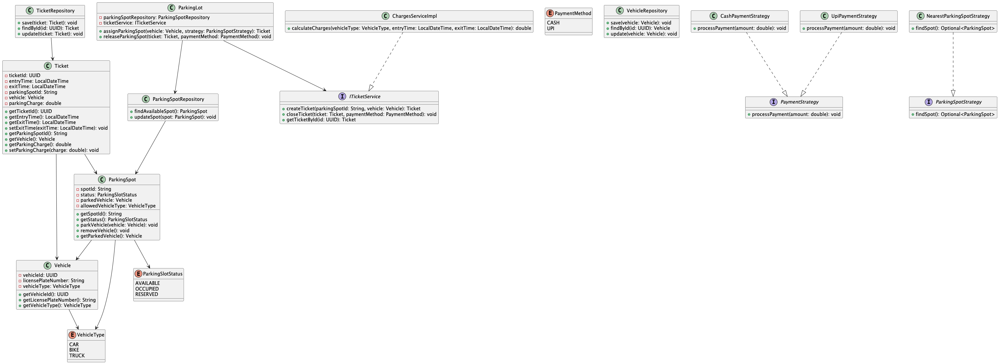
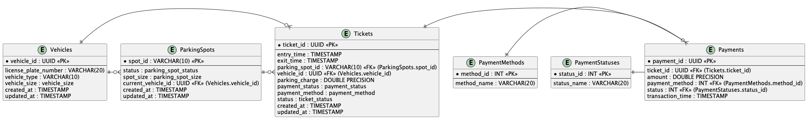

# Automated Parking Lot

## API Specification
### Endpoints
1. `POST v1/vehicles` - register a vehicle
    * payload:
    ```json
    {
        "license_plate": "KA01MN3185",
        "vehicle_size" : "Small/Medium/large/extra_large",
        "vehicle_type" : "“Car/Bike/Truck”"
    }
    ```
    * response:
    ```json
    {
        "vehicle_id": "44e128a5-ac7a-4c9a-be4c-224b6bf81b20",
        "license_plate": "KA01MN3185",
        "vehicle_size" : "Small/Medium/large/extra_large",
        "vehicle_type" : "Car/Bike/Truck",
        "created_at": "2025-01-10T10:00:00Z"
    }
    ```

2. `GET /v1/vehicles/{vehicleId}` - Get vehicle details
    * response:
    ```json
    {
        "vehicle_id": "44e128a5-ac7a-4c9a-be4c-224b6bf81b20",
        "license_plate": "KA01MN3185",
        "vehicle_size" : "Small/Medium/large/extra_large",
        "vehicle_type" : "Car/Bike/Truck",
        "created_at": "2025-01-10T10:00:00Z"
    }
    ```
3. `GET v1/vehicles` - List all registered vehicles
    * query params :
        * `page` : 1
        * `pageSize` : 10
          response:
    ```json
       {
        "totalItems": 50,
        "page": 1,
        "pageSize": 10,
        "data": [
                 {
                    "vehicle_id": "44e128a5-ac7a-4c9a-be4c-224b6bf81b20",
                    "license_plate": "KA01MN3185",
                    "vehicle_size" : "Small",
                    "vehicle_type" : "Car",
                    "created_at": "2025-01-10T10:00:00Z"
                 },
                {
                    "vehicle_id": "44e128a5-ac7a-4c9a-be4c-2esajgjb81b20",
                    "license_plate": "KA01MN3186",
                    "vehicle_size" : "Medium",
                    "vehicle_type" : "Car",
                    "created_at": "2025-01-10T10:00:00Z"
                 }
                ]
        }
    ```
4.`POST v1/parking/park` - Park a vehicle and generate ticket
   * payload:
       ```json
         {
            "vehicle_id": "44e128a5-ac7a-4c9a-be4c-2esajgjb81b20",
          }
       ```
  * response:
    ```json
          {
                "ticket_id": "12345",
                "message": "Car parked successfully"
          }
    ```
5.`POST v1/parking/retrive` - Park a vehicle and generate ticket
    * payload:
```json
       {
            "ticket_id": "12345"
       }
```
* response:
    ```json
    {
         "message": "Vehicle retrieved successfully."
    }
    ```
6.`GET GET /v1/parking/available-spaces` - return the number of available parking spaces in the parking lot
* response:
    ```json
    {
        "availableSpaces": 8
    }
    ```
7.`GET /api/tickets/{ticketId}` - Get ticket details
   * response:
        ```json
       {
            "ticketId": 101,
            "licensePlate": "ABC123",
            "vehicleType": "Car",
            "parkingSpaceId": 5,
            "timestamp": "2025-01-04T12:00:00Z"
         }
     ```
8.`GET /api/spots/status` - Get Overall Parking Status
* response:
  ```json
     {
       "totalSpots": 100,
       "availableSpots": 8,
       "occupiedSpots": 92,
       "percentageOccupied": 92.0
     }
  ```
9.`POST /v1/tickets/{ticketId}/payment` - Process payment
  * request:
   ```json
        {
          "paymentAmount": 20.0,
          "paymentMethod": "Credit Card",
          "paymentDetails": {
              "cardNumber": "1234567812345678",
              "expirationDate": "12/25",
              "cvv": "123"
                          }
        }
```
* response:
    ```json
    {
    "message": "Payment processed successfully.",
    "ticketId": 101,
    "paymentAmount": 20.0,
    "paymentStatus": "Completed",
    "timestamp": "2025-01-04T12:30:00Z"
   }
  ```

## Class Diagram



## Schema Diagram



## Sequence Diagram

