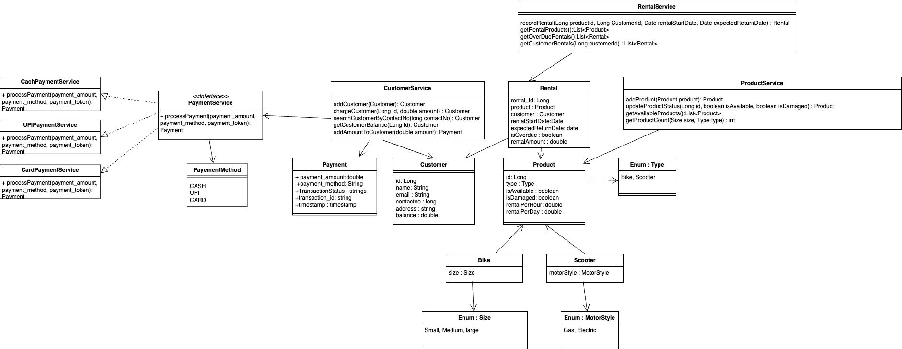
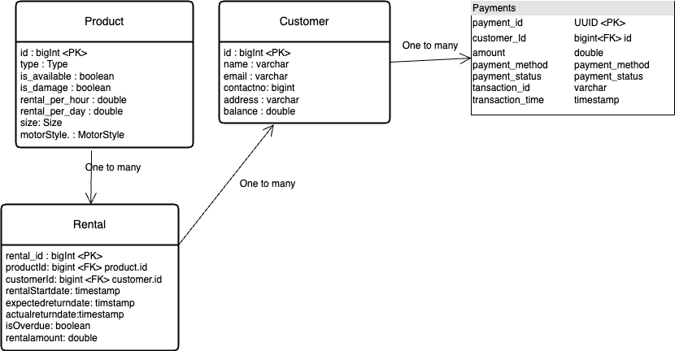

# Bike rental shop

## Requirements

1. bike shop should have the feature to rent the bike and scooters 
2. bike shop inventory also will be tracked 
3. rented items should also been able to track 
4. bike shop should be able to track the customers who had rented bike/scooter 
5. bike shop would be able to calculate the price of the rented bike/scooter 
6. bike shop should have two type of products bike and scooter 
7. bike sizes can be small, medium, large 
8. scooter should support gas motor, electric

## API Specification
### Endpoints
1. `POST v1/products` - add product
    * payload:
    ```json
    {
        "type": "BIKE/SCOOTER",
        "size" : "Small/Medium/large",  //Required if BIKE
        "motorStyle" : "gas/Electric", // Required if SCOOTER
        "rentalPerHour": 100,
        "rentalPerDay": 500
    }
    ```
    * response:
    ```json
    {
        "id": "prod1",
        "type": "BIKE",
        "size" : "Small",
        "rentalPerHour": 100,
        "rentalPerDay": 500,
        "isAvailable": true
    }
    ```
   
2. `PATCH v1/products/{id}` - remove the product and mark it as unavailable and damage
    * payload:
    ```json
    {
        "isAvailable": false,
        "isDamaged": true
    }
    ```
    * response:
    ```json
    {
        "id": "prod1",
        "type": "BIKE",
        "size" : "Small",
        "rentalPerHour": 100,
        "rentalPerDay": 500
    }
    ```
3. `GET v1/products/available` - get all available products'
      * query params : 
        * `page` : 1
        * `pageSize` : 10
   response:
    ```json
       {
        "totalItems": 50,
        "page": 1,
        "pageSize": 10,
        "data": [
                 {
                  "id": "prod1",
                  "type": "BIKE",
                  "size": "Small",
                  "rentalPerHour": 100,
                  "rentalPerDay": 500
                 }
                ]
        }
    ```
   4.`GET v1/products/count` - get count of any type of bikes
    * query params : 
        * `size` : Small
        *  `type` : BIKE
    * response:
    ```json
          {
              "count": 10
          }
    ```
   5.`POST v1/customers` - add customer
    * payload:
    ```json
       {
           "name": "John Doe",
           "email" : "",
           "contactNumber" : "1234567890",
           "address": "Bangalore"
       }
    ```
    * response:
    ```json
    {
        "id": 1,
        "name": "John Doe",
        "email" : "",
        "contactNumber" : "1234567890",
        "address": "Bangalore",
        "balance": 0
    }
    ```
   6.POST v1/customers/{id}/add-balance - Add balance to the customer
      * payload:
        ```json
                {
                 "amount" : 1000,
                "payment_method" : "Credit Card",
                "token": "tok_123456789abcdef"
                }
        ```
        * response:
          ```json
           {
               "message": "Payment processed successfully.",
               "customer_id": "cust007",
               "paymentAmount": 100.0,
               "paymentStatus": "Completed",
               "transactionId": "txn_987654321",
               "timestamp": "2025-01-04T12:30:00Z"
             }
        ``` 
   7.GET /v1/customers/search - search customers by name
      * query params :
        * `contact_no` : 9712798172
    * response:
    ```json
              {
                  "id": 1,
                  "name": "John Doe",
                  "email" : "",
                  "contactNumber" : "1234567890",
                  "address": "Bangalore",
                  "balance": 1000
                 }
    ```
   8.`GET v1/customers/{id}/balance` - return a boolean if the customer has enough balance to rent a product
    * response:
    ```json
    {
        "balance": 1000,
        "owesMoney": false
    }
    ```
   9.`GET v1/rentals/rented` - List currently rented products
      * query params :
        * `page` : 1
        * `pageSize` : 10
    * response:
        ```json
       {
        "totalItems": 50,
        "page": 1,
        "pageSize": 10,
        "data": [
                 {
                  "id": 1,
                  "type": "BIKE",
                  "size": "Small",
                  "rentalPerHour": 100,
                  "rentalPerDay": 500,
                  "customerId": "cust007"
                 }
                ]
        }
    ```
10.`GET v1/rentals/overdue` - List overdue rentals and customers. Overdue rentals are the ones which are not returned within the rental period
  * response:
  ```json

{
   "totalItems" : 50,
   "page" : 1,
   "pageSize": 10,
   "data" : [
      {
         "rentalId": 1,
         "product": {
            "id": "p001",
            "type": "BIKE/SCOOTER",
            "size" : "Small/Medium/large",
            "motorStyle" : "gas/Electric",
            "rentalPerHour": 100,
            "rentalPerDay": 500
         },
         "customer" : {
            "id": "cust007",
            "name": "John Doe",
            "contact_no": 291748971
         },
         "rentalStartDate": "10/01/2025",
         "expectedReturnDate": "15/01/2025",
         "actualReturnDate": null,
         "rentalAmount": 900,
         "isOverdue": true,
         "daysOverdue": 5
      }
   ]
}
  ```
 11.`GET v1/customers/{id}/rentals` - get Rentals by customer
  * response:
  ```json
  [
      {
          "rentalId": 1,
          "productId": {
                       "id": "p001",
                       "type": "BIKE/SCOOTER",
                       "size" : "Small/Medium/large",
                       "motorStyle" : "gas/Electric",
                       "rentalPerHour": 100,
                       "rentalPerDay": 500
             },
          "rentalStartDate": "10/01/2025",
          "expectedReturnDate": "15/01/2025",
          "actualReturnDate": null,
          "rentalAmount": 900,
          "isOverdue": true
      }
  ] 
  ```
 12.`POST v1/rentals` - Record a Product Rental
  * payload:
  ```json
  {
      "productId": "p001",
      "customerId": "cust007",
      "rentalStartDate": "10/01/2025",
      "expectedReturnDate": "15/01/2025"
  }
  ```
  * response:
  ```json
  {
      "rentalId": 1,
      "productId": {
                       "id": "p001",
                       "type": "BIKE/SCOOTER",
                       "size" : "Small/Medium/large",
                       "motorStyle" : "gas/Electric",
                       "rentalPerHour": 100,
                       "rentalPerDay": 500
             },
          "customerId" : {
                        "id": "cust007",
                        "name": "John Doe"
                        },
          "rentalStartDate": "10/01/2025",
          "expectedReturnDate": "15/01/2025",
          "actualReturnDate": null,
          "rentalAmount": 900,
          "isOverdue": false
  }
  ```
 13.`PATCH v1/customers/{id}/charge` - Create a charge for the customer
  * payload:
  ```json
  {
      "amount": 100
  }
  ```
  * response:
  ```json
  {
      "id": 1,
      "name": "John Doe",
      "email" : "",
      "contactNumber" : "1234567890",
      "address": "Bangalore",
      "balance": 900
  }
  ```

## Class Diagram



## Schema Diagram

1. **Product ↔ Rental (One-to-Many)**
   * Relationship: A Product can have multiple Rentals, but each Rental is linked to only one Product.
   * Reason: A product (like a bike or scooter) can be rented multiple times by different customers over time, but at any given time, one rental record corresponds to one product.

   * **Notation:** Product "1" <-- "*" Rental : rented_by
     * "1" near Product indicates that one product can be involved in many rentals.
     * "*" near Rental indicates that there can be multiple rentals associated with a single product.
2. **Customer ↔ Rental (One-to-Many)**
   * Relationship: A Customer can have multiple Rentals, but each Rental is linked to only one Customer.
   * Reason: A customer may rent multiple products at different times or even multiple products simultaneously, but each rental record will belong to one specific customer.

   * **Notation:** Customer "1" <-- "*" Rental : associated_with
     * "1" near Customer indicates that one customer can have many rentals.
     * "*" near Rental indicates that there can be multiple rentals tied to a single customer.



## Sequence Diagram

